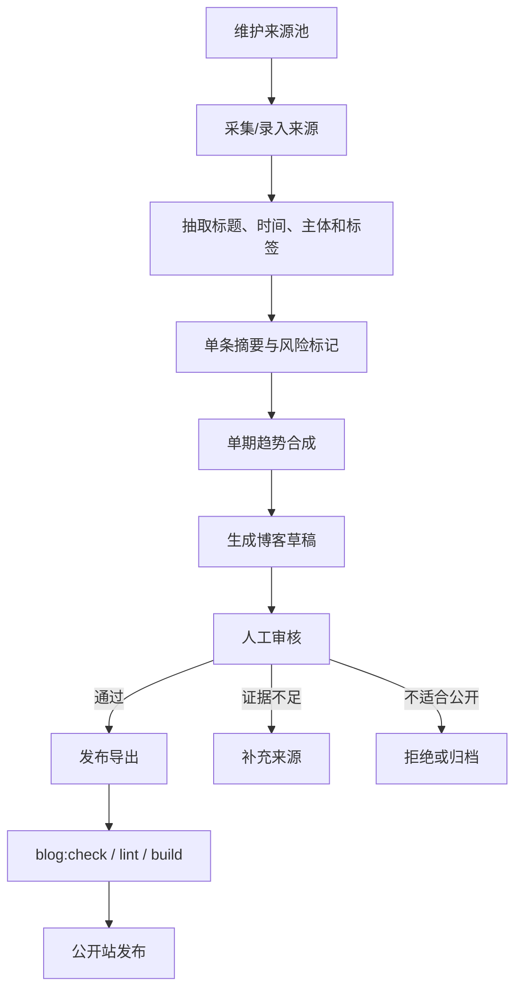
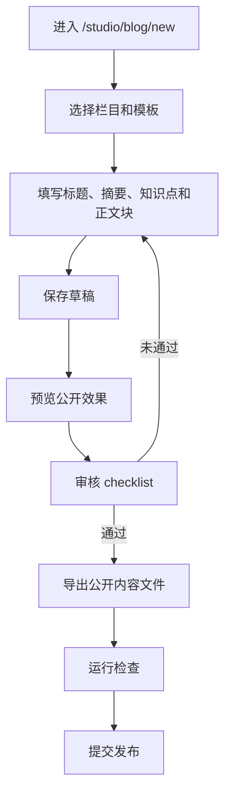

# AI 日报与内容工作台设计

## Architecture Decision

采用 **Hybrid Content Studio**：

- 公开站继续保持静态优先：`/blog`、`/blog/:slug`、项目详情页等公开页面读取已审核的内容产物。
- 新增内部 `/studio` 工作台：负责草稿、来源池、AI 日报 issue、审核、预览和发布导出。
- 后端复用现有 `server/`、Express、Prisma、Postgres 能力，不再把内容编辑硬塞进纯前端数据文件。
- 发布时从数据库中的 approved 内容导出到公开内容格式，继续接受 `blog:check`、`lint`、`build` 的验证。

这不是把站点彻底改成全动态 CMS，而是把“编辑面”和“公开发布面”分层。

## Current-State Constraints

- 当前博客公开数据分散在：
  - `src/data/blog.ts`
  - `src/data/blogContent.ts`
  - `src/data/blogCuration.ts`
  - `src/data/blog-posts/*.ts`
- 当前后端已有：
  - Express app: `server/src/app.ts`
  - Prisma schema: `prisma/schema.prisma`
  - 管理 token 与邀请制成员模型
  - RAG orchestrator 和模型配置
- 当前 AI 日报只有离线脚本：
  - `scripts/generate-ai-daily-draft.mjs`
  - `docs/ai-daily-pipeline.md`
  - `.trellis/spec/backend/ai-daily-workflow.md`

## Target Boundaries

### Public Site

职责：

- 展示已发布博客、项目、资源和状态页。
- 不显示未审核草稿。
- 不要求访客请求数据库才能打开公开文章。

推荐保持：

- Vite 静态构建。
- 公开内容由导出的 typed data 或后续统一内容 JSON/Markdown 生成。
- 公开助手可引用已发布内容和已同步知识库。

### Content Studio

路径建议：

- `/studio`
- `/studio/blog`
- `/studio/blog/new`
- `/studio/blog/:draftId`
- `/studio/ai-daily`
- `/studio/ai-daily/:issueId`
- `/studio/sources`
- `/studio/review`
- `/studio/publish`

职责：

- 新建和编辑博客草稿。
- 管理 AI 日报来源池和单期 issue。
- 维护栏目、标签、知识点、关联项目、可见性和审核状态。
- 预览公开文章效果。
- 审核通过后导出到公开内容产物。

### Backend API

建议路由前缀：

- `/studio/api/content-drafts`
- `/studio/api/source-items`
- `/studio/api/ai-daily/issues`
- `/studio/api/reviews`
- `/studio/api/publish-exports`

认证：

- 第一阶段复用 `ADMIN_TOKEN` 保护工作台写操作。
- 后续可扩展到现有 `Member` / `Invite` 权限，增加 `EDITOR` 角色。

### Database

新增 Prisma 模型方向：

- `ContentDraft`
  - `id`
  - `slug`
  - `title`
  - `column`
  - `tag`
  - `detail`
  - `bodyJson`
  - `status`
  - `visibility`
  - `aiAssistance`
  - `createdBy`
  - `updatedBy`
  - `createdAt`
  - `updatedAt`
- `ContentReview`
  - `id`
  - `draftId`
  - `status`
  - `checklistJson`
  - `notes`
  - `reviewedBy`
  - `reviewedAt`
- `SourceItem`
  - `id`
  - `title`
  - `url`
  - `sourceName`
  - `sourceTier`
  - `language`
  - `publishedAt`
  - `capturedAt`
  - `rawExcerpt`
  - `summary`
  - `tagsJson`
  - `riskFlagsJson`
- `AiDailyIssue`
  - `id`
  - `date`
  - `title`
  - `status`
  - `sourceIdsJson`
  - `briefJson`
  - `draftId`
- `PublishExport`
  - `id`
  - `draftId`
  - `target`
  - `exportedFilesJson`
  - `checksJson`
  - `exportedBy`
  - `createdAt`

第一阶段可以先只加博客/AI 日报必需字段；不要一次性做完整企业 CMS。

## Content Model

工作台内部使用结构化 JSON，避免编辑器一开始就绑定 TypeScript 文件形态：

```ts
type ContentBody = {
  blocks: Array<
    | { type: 'paragraph'; text: string }
    | { type: 'heading'; level: 2 | 3; text: string }
    | { type: 'list'; items: string[] }
    | { type: 'image'; assetId?: string; src?: string; alt: string; caption?: string }
    | { type: 'flow'; mermaid: string; caption?: string }
    | { type: 'source-card'; sourceItemId: string }
  >
}
```

导出器负责把 `ContentBody` 转成当前公开站能读取的 `BlogPost` 结构，或后续迁移到更自然的 Markdown/MDX。

## AI Daily Flow



## Blog Quick Submit Flow



## Model Use Boundary

- 默认不做模型测活。
- 模型只在具体内容任务中被调用，例如“把这 5 条来源转成结构化摘要”。
- AI 输出必须写入 `aiAssistance`、来源引用、review checklist 和风险标记。
- 模型配置只读环境变量或本地安全配置，不写进公开数据。

## Feasibility Assessment

可行，而且比从零引入外部 CMS 更顺：

- 现有仓库已经有后端、数据库、权限雏形和部署经验。
- 当前博客静态数据结构清晰，适合做导出目标。
- AI 日报已经有离线草稿脚本，可作为工作台流程的早期导入/导出基础。
- 最大风险不是技术能不能做，而是内容模型迁移与发布源-of-truth 的复杂度。

推荐先做“数据库草稿 + 静态导出”的混合模型。这样可以获得编辑体验，又不破坏公开站稳定性。

## Alternatives

### Full Dynamic CMS

公开站每次请求都从数据库读文章。

优点：后台修改后立刻生效。

缺点：公开站依赖数据库可用性，缓存、SEO、部署和回滚都更复杂。

### Git-Backed Editor

后台直接写 Markdown/JSON/TS 文件并提交到 Git。

优点：版本可追溯，和当前静态站天然匹配。

缺点：服务端 Git 权限、冲突处理、提交安全和 Windows/Render 环境兼容性更复杂。

### External Headless CMS

接入 Strapi、Directus、Payload、Supabase Studio 或类似工具。

优点：现成后台多。

缺点：字段、权限、部署、迁移和站点现有内容模型会被外部系统牵引；对当前项目来说不一定更省事。

## Recommended First Implementation Shape

1. 后端新增内容模型和受保护 CRUD API。
2. 前端新增 `/studio` 工作台壳和博客草稿编辑页。
3. AI 日报 source pool 和 issue 页面复用同一个草稿/审核模型。
4. 做导出器，把 approved draft 写入当前 `src/data/blog*.ts` 兼容格式。
5. 通过检查后再公开发布。

