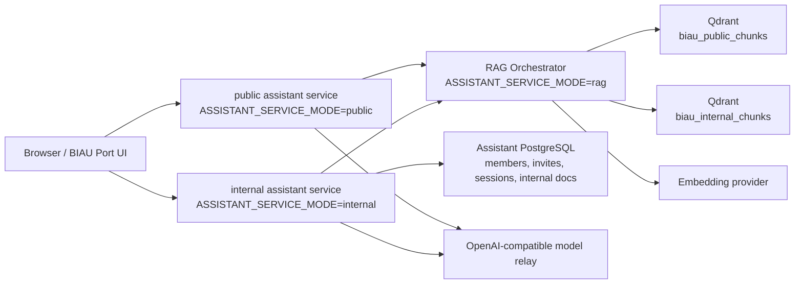

# Internal assistant finalization design

## Architecture

目标架构保持单仓库、三服务边界：

- Public API 只暴露 `/health` 与 `/chat/public`，只能使用 public RAG key。
- Internal API 暴露 member auth、internal chat、admin routes、internal knowledge routes，使用 internal RAG key 和 server-only sync token。
- RAG Orchestrator 暴露 `/health`、`/v1/retrieve`、`/v1/sync`，负责 embedding、Qdrant sync/retrieve、scoped auth。
- 浏览器只知道 public/internal API base URL；任何 RAG key、sync token、Qdrant key、embedding key、database URL 都留在服务端。

## Data Model

在现有 `Invite`、`Member`、`ChatSession`、`ChatMessage`、`UsageLog` 基础上小步扩展。

Recommended additions:

- `Member`
  - `status`: `ACTIVE | DISABLED`
  - `disabledAt`: nullable DateTime
  - `lastSeenAt`: nullable DateTime
  - `modelChannelId`: nullable String, defaulting to the server default channel when absent.
- `ChatSession`
  - `archivedAt`: nullable DateTime
  - `lastMessageAt`: nullable DateTime
- `Invite`
  - 已有 `expiresAt`、`usedCount`、`maxUses` 可继续使用；如需撤销可新增 `revokedAt`。
- `InternalKnowledgeDocument`
  - `id`, `slug`, `title`, `summary`, `body`
  - `tags` Json
  - `status`: `DRAFT | REVIEWED | ACTIVE | ARCHIVED`
  - `sourceType`: `manual | repo-note | deployment-note | project-note`
  - `safetyNotes`: nullable String
  - `contentHash`: String
  - `lastSyncedAt`: nullable DateTime
  - `createdByMemberId`: nullable String
  - timestamps
- `InternalKnowledgeSyncRun`
  - `id`, `status`, `documentCount`, `chunkCount`, `issueCount`, `startedAt`, `finishedAt`, `diagnostic` Json

不在本任务把 public static knowledge 搬入数据库。public knowledge 继续由 `src/data/assistant.ts` 和 `server/data/public-knowledge-v2.json` 管理；internal corpus 是额外的 curated layer。

## API Contracts

### Model channels

- Server env defines channels through `ASSISTANT_MODEL_CHANNELS_JSON`.
- Existing `ASSISTANT_MODEL_*` remains the default channel for public assistant and for members without an assignment.
- A channel contains server-only fields `{ id, label, provider, baseUrl, apiKey, model }`.
- Admin/member payloads expose only safe fields `{ id, label, provider, model, configured, isDefault }`.
- Invalid channel ids fall back to default; fallback responses must not reveal the missing id as a secret-bearing config value.

### Member workspace

- `GET /me`
  - Auth: member bearer token.
  - Returns member profile, assigned model channel summary, quota, lightweight service status.
- `GET /chat/internal/sessions`
  - Auth: member bearer token.
  - Returns non-archived sessions for current member, newest first.
- `POST /chat/internal/sessions`
  - Auth: member bearer token.
  - Creates an empty session with optional title.
- `GET /chat/internal/sessions/:id/messages`
  - Auth: member bearer token.
  - Only returns messages where `session.memberId === currentMember.id`.
- `PATCH /chat/internal/sessions/:id`
  - Auth: member bearer token.
  - Supports title update and archive/unarchive.
- `POST /chat/internal`
  - Existing route remains the send-message contract.
  - If `sessionId` is absent, create session.
  - If `sessionId` belongs to another member, ignore or return 404; do not attach cross-member messages.

### Admin

- `GET /admin/summary`
  - Expand current counts with active/disabled members, open/revoked/expired invites, internal knowledge count, last sync status.
- `GET /admin/members`
  - Admin token.
  - Paginated lightweight list, including each member's assigned safe model channel summary.
- `PATCH /admin/members/:id`
  - Admin token.
  - Disable/enable member, optionally reset quota later, and assign `modelChannelId`.
- `GET /admin/model-channels`
  - Admin token.
  - Returns sanitized model channel summaries only.
- `GET /admin/invites`
  - Admin token.
  - List invite metadata without code plaintext.
- `POST /admin/invites`
  - Existing create route remains; never returns code hash.
- `PATCH /admin/invites/:id`
  - Admin token.
  - Revoke or set expiration.
- `GET /admin/knowledge-documents`
  - Admin token.
  - List internal docs with status and sync metadata.
- `POST /admin/knowledge-documents`
  - Admin token.
  - Creates draft/reviewed internal doc. Request body must be validated explicitly.
- `PATCH /admin/knowledge-documents/:id`
  - Admin token.
  - Updates safe fields and status.
- `POST /admin/knowledge/sync`
  - Admin token.
  - Internal service reads active/reviewed docs, chunks them, calls RAG `/v1/sync` with server-only sync token, records sync run.

### RAG Orchestrator

- `POST /v1/retrieve`
  - Existing contract stays `{ query, scope, limit, locale }`.
  - Public key can retrieve only `scope=public`.
  - Internal key can retrieve only `scope=internal`.
- `POST /v1/sync`
  - Extend payload to accept `{ scope?: "public" | "internal", documents?: RagSyncDocument[] }`.
  - Default/no payload keeps current public sync from `publicKnowledgeV2`.
  - Internal sync requires sync token and writes only to `QDRANT_INTERNAL_COLLECTION`.

## Retrieval Flow

1. Internal user sends a message.
2. Internal API validates member token and session ownership.
3. `planAssistantAnswer(question, "internal")` decides retrieval intent.
4. Internal API calls RAG Orchestrator with internal RAG key and `scope="internal"`.
5. RAG Orchestrator queries public + internal Qdrant collections for internal scope.
6. RAG response returns citations/chunks with visibility metadata and sanitized retrieval meta.
7. Internal API calls model provider only server-side, with citations/chunks as grounding.
8. The selected model channel comes from `Member.modelChannelId` or the server default channel.
9. Answer, citations, and sanitized meta are stored in `ChatMessage` / `UsageLog`.

Fallback:

- RAG unavailable -> internal API uses deterministic local/public fallback plus clear limitation.
- Internal collection empty -> internal retrieval may still cite public collection and state that no reviewed internal corpus is synced yet.
- Model unavailable -> return bounded fallback answer with citations and provider diagnostic category only.

## UI Design

`/assistant` should become a work-focused app surface:

- Left rail: member card, new chat button, real session list, archived toggle.
- Main panel: current conversation, compact empty state, streaming-style loading state if available, citations under assistant messages.
- Right panel: answer sources, service state, current retrieval mode, safe warnings, suggested workflows.
- Composer: clear disabled state when unauthenticated; after login, send to API by default.

`/assistant/admin` should become a tabbed admin surface:

- Overview: counts, service status, last sync run.
- Invites: create/list/revoke/expire.
- Members: list/disable/enable/basic usage.
- Model Channels: visible as a member assignment control, not as an editable secret editor.
- Knowledge: create/edit/review/archive internal docs, trigger sync, inspect last low-sensitive sync diagnostic.

Prefer Semi Design primitives for new controls where it fits the existing styling; keep the current assistant visual language cohesive instead of introducing another UI framework.

## Safety

- Member tokens and admin token are never logged or rendered except masked local input state.
- Model channel API keys and base URLs stay in environment variables only. The database stores only safe channel ids.
- Invite codes are accepted only as plaintext on create/redeem; persisted value remains hash-only.
- Internal knowledge documents must have explicit status; only reviewed/active docs sync to Qdrant.
- Public retrieve path must never query internal collection, even when internal collection exists.
- Error responses use stable low-sensitive codes, not raw provider/database errors.
- Sync diagnostics may include counts, status classes, and provider category; never include endpoint URLs, headers, keys, raw response bodies, or original private document payload.

## Rollout And Rollback

- Schema additions are additive. Existing invites/members/sessions continue to work.
- Frontend can keep local fallback for unauthenticated/offline states, but copy must clearly mark it as limited.
- If knowledge sync breaks, disable admin sync button or return sanitized failure; chat/history/admin core should remain usable.
- If Qdrant internal sync is not configured in production, internal assistant should still run with public knowledge + clear "internal corpus not synced" status.

## Trade-Offs

- Database-managed internal docs are more work than a static JSON file, but they make the admin surface and future review workflow real.
- Internal service pushing docs to RAG sync keeps the RAG service independent from the assistant database, reducing coupling between Render services.
- Not introducing Neo4j keeps the current RAG path focused on the biggest quality gains: hybrid retrieval, scoped corpora, citations, rerank/self-check, and better source management.
